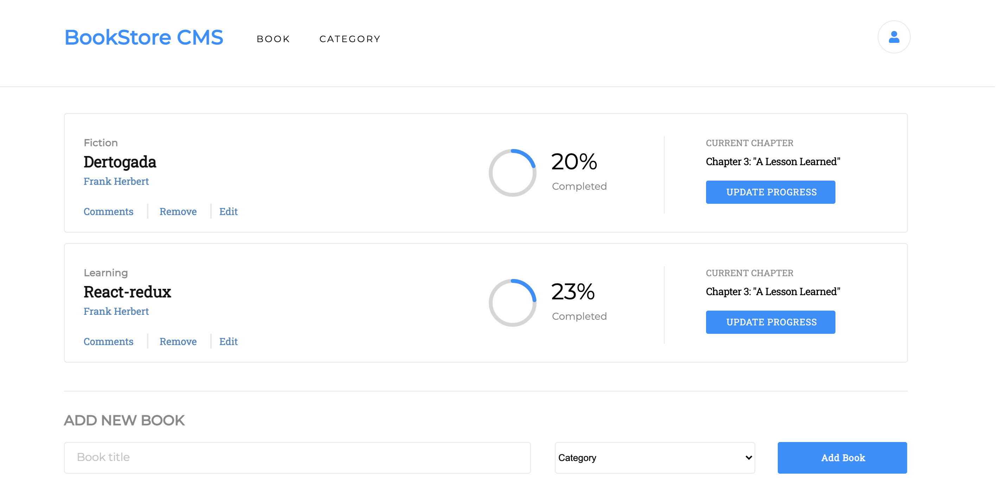

# Book-Store

> Book-store has created a desktop-only app for storing displaying and removing books in the library using react-redux.
> 

## Built With

- Node.js
- React
- React-DOM
- React-Create-App
- npm
- CSS
- ES6

## Live Demo

[Live Demo Link](https://addis-bookstore.herokuapp.com)

## Getting Started

To set up a local copy of the project

- `git@github.com:Addis0943/book-store.git`
- `cd book-store`
- `Run npm start`

## Author

👤 **Dagic Zewdu Tilahun**

- GitHub: [@Dagic-zewdu](https://github.com/Dagic-zewdu)
- Twitter: [@dagic4](https://twitter.com/dagic4)
- LinkedIn: [LinkedIn](https://www.linkedin.com/in/dagi-zewdu-21b835215/)

## 🤝 Contributing

Contributions, issues, and feature requests are welcome!

Feel free to check the [issues page](../../issues/).

## Show your support

Give a ⭐️ if you like this project!

## Acknowledgments

- Hat tip to anyone whose code was used
- Inspiration
- etc

## 📝 License

This project is [MIT](./MIT.md) licensed.
